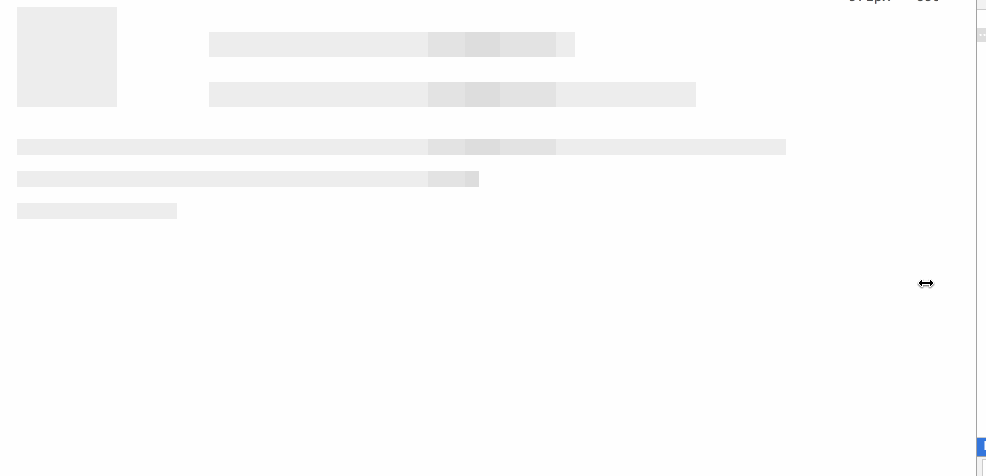

# vue-content-placeholder


Inspired by [Facebook content placeholder deconstruction](http://cloudcannon.com/deconstructions/2014/11/15/facebook-content-placeholder-deconstruction.html)

## Get stared

Here is [DEMO](https://stevenyuysy.github.io/vue-content-placeholder/).



## How does it work?

You can check out the article above. The difference is that I use the property of `flex` instead of `absolute` in every row.

The boxes can be custom height and custom width, you can choose a fixed height with `px`, or just use Number to declare its `flex-basis` or use `%`, `em` ...

### How to use?

#### ES6

```js
/* in xxx.vue */
<content-placeholder :rows="placeholderRows"></content-placeholder>

import ContentPlaceholder from 'vue-content-placeholder'

export default {
  ...
  data () {
    return {
      placeholderRows:  [
        {
          height: '25px',
          boxes: [[0, '100px']]
        },
        {
          height: '25px',
          boxes:[[0, '100px'], ['10%', 1]]
        },
        {
          height: '25px',
          boxes: [[0, '100px']]
        },
        {
          height: '25px',
          boxes:[[0, '100px'], ['10%', 2]]
        },
        { height: '2rem',
          boxes: [[0, 0]]
        },
        { height: '1rem',
          boxes: [[0, 5]]
        },
        { height: '1rem',
          boxes: [[0, 0]]
        },
        { height: '1rem',
          boxes: [[0, '50%']]
        },
        { height: '1rem',
          boxes: [[0, 0]]
        },
        { height: '1rem',
          boxes: [[0, '10em']]
        }
      ]
    }
  },
  components: {
    ContentPlaceholder
  },
  ...
}
```

## Option

| Options | type | discription|
| -- | -- | -- |
| rows | Array  | The property of the component |
| row  | Object | The element of the rows |
| row.height | String | The height of the row, support `px`, `rem`, `em`, `%` |
| row.boxes | Array | The transition boxes of the row |
| box | Array | The box in the row.boxes |
| box[0] | String or Number | To declare the width of the left gutter |
| box[1] | String or Number | To declare the width of the box |
| size | String | Control the animation, such as 250% or 900px |


## Contribution

- Fork it
- PR
